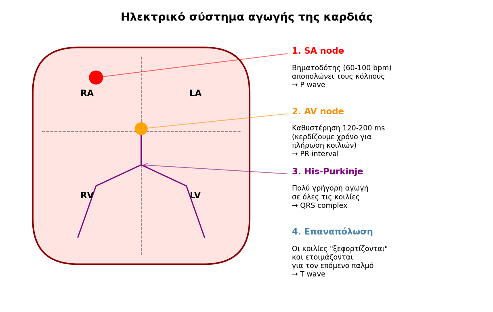
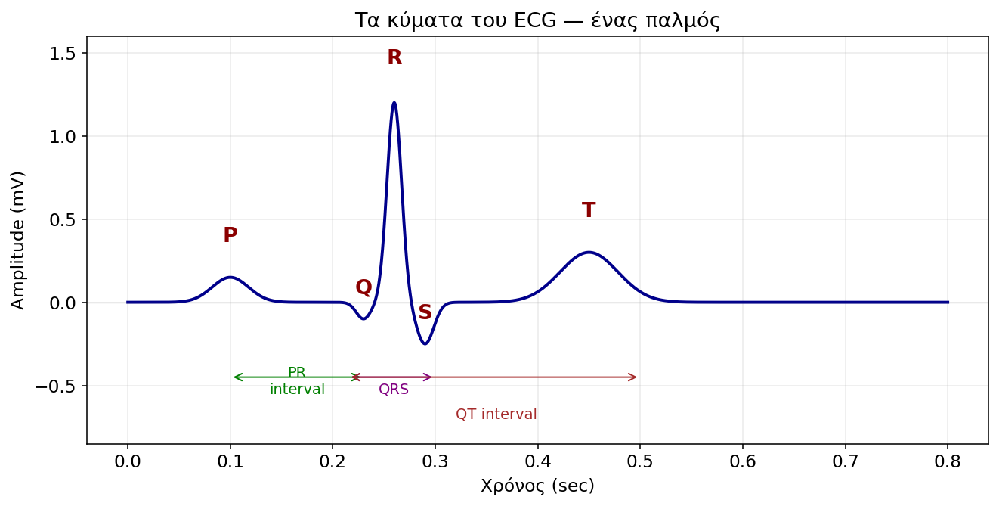
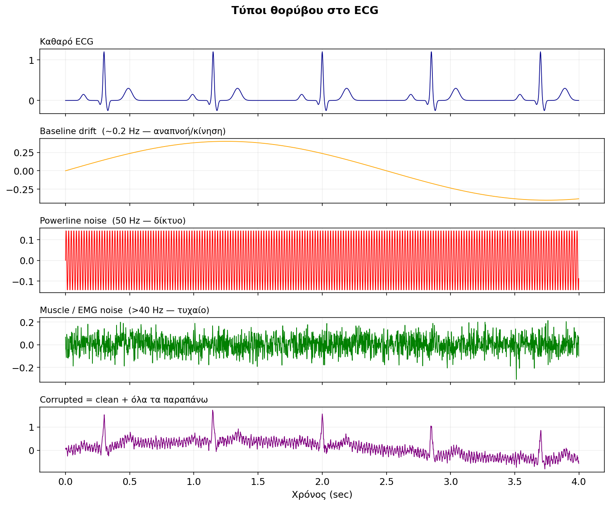
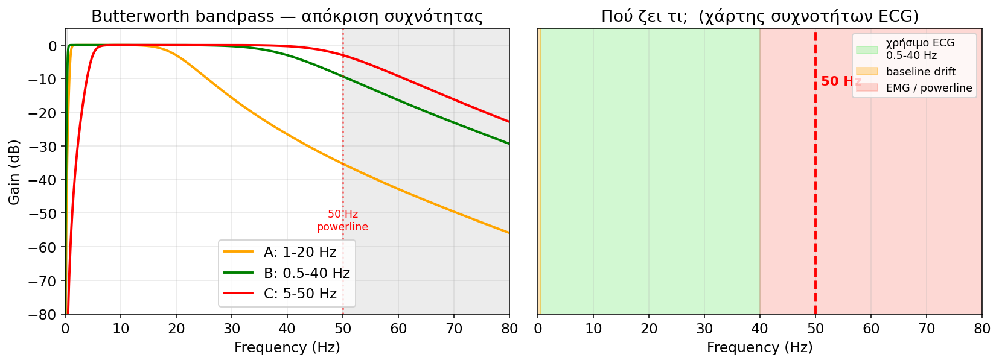
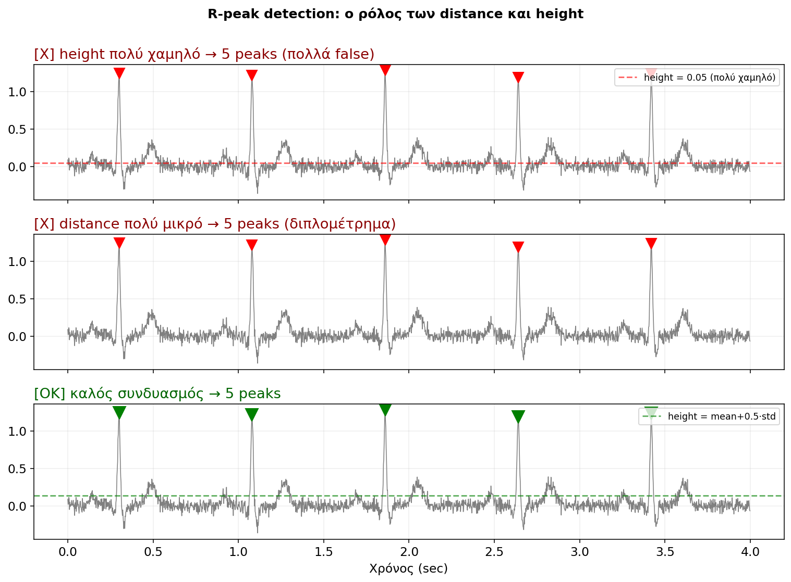
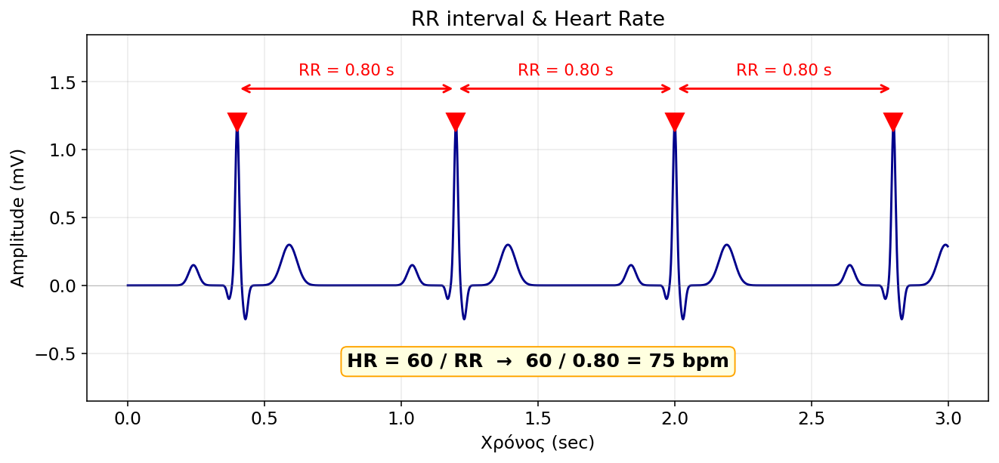
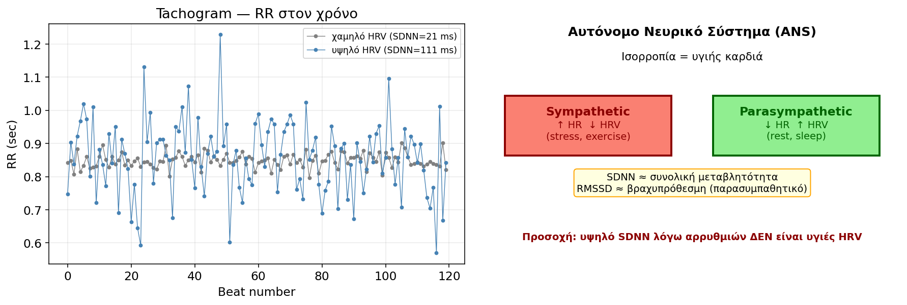
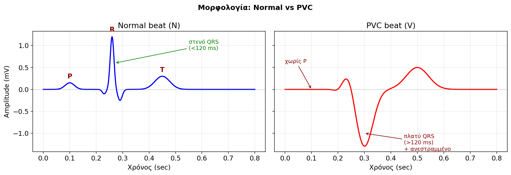
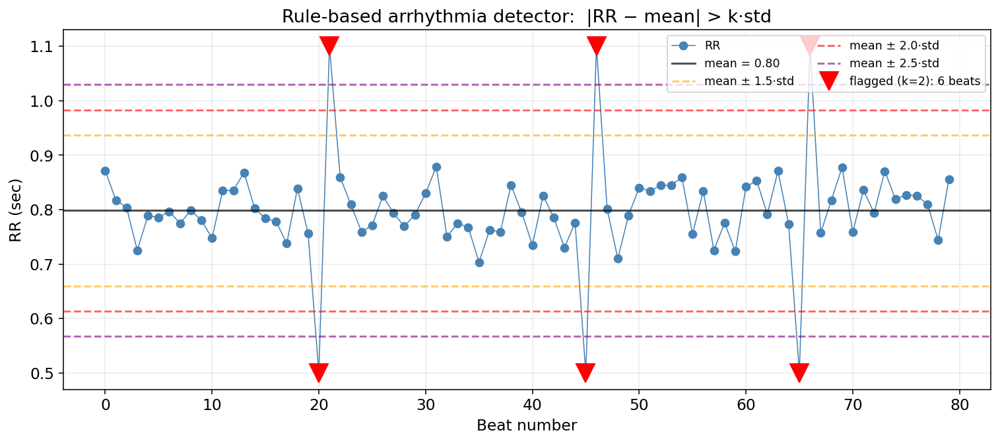

<!-- _class: title -->

# Ανάλυση Ηλεκτροκαρδιογραφήματος (ECG)

## Βιοϊατρικά Σήματα & Εφαρμογές — Εργαστήριο

  

**MIT-BIH Database · PhysioNet · Python**

Διάρκεια: 3 ώρες · 3 ομάδες · 1 notebook

---

# Πώς θα δουλέψουμε σήμερα

**Δύο οθόνες, παράλληλα:**
- **Αριστερά (slides):** η θεωρία πίσω από κάθε βήμα
- **Δεξιά (notebook):** ο κώδικας που υλοποιεί τη θεωρία

 

| Ομάδα | Record | Περιγραφή                                       |
|-------|--------|--------------------------------------------------|
| **A** | 100    | Σχεδόν φυσιολογική καταγραφή                    |
| **B** | 106    | Πολλές εκτοπες κοιλιακές συστολές (PVC)         |
| **C** | 119    | Ακανόνιστος ρυθμός                              |

> ⚠ Κάθε ομάδα αλλάζει **μόνο** την τιμή `record_id` — όλος ο υπόλοιπος κώδικας μένει ίδιος.

---

# Πρόγραμμα 3 ωρών

| Ώρα | Περιεχόμενο                                         |
|-----|------------------------------------------------------|
| 1η  | Σήμα ECG · θόρυβος · ψηφιακό **filtering**          |
| 2η  | **R-peak detection** · **Heart Rate** · **HRV**     |
| 3η  | Αρρυθμίες · σύγκριση ομάδων · (bonus: spectral, ML) |

 

**Στόχος μάθησης:**
1. Να κατανοήσετε ότι **ένα βιοσήμα δεν ζει στο κενό** — έχει φυσιολογική σημασία.
2. Να εφαρμόσετε τις βασικές τεχνικές DSP **σε πραγματικά δεδομένα**.
3. Να μάθετε να **ερμηνεύετε** μετρήσεις (HR, SDNN, PVC%) — όχι απλώς να τις υπολογίζετε.

---

<!-- _class: section -->

# ΕΝΟΤΗΤΑ 1
## Τι είναι το ECG;

---

# Η καρδιά είναι ένα **ηλεκτρικό όργανο**

Συνήθως σκεφτόμαστε την καρδιά ως **αντλία**. Αλλά:

- Κάθε παλμός ξεκινά από **ηλεκτρικό σήμα** που γεννιέται **μέσα** στην καρδιά.
- Δεν χρειάζεται εντολή από τον εγκέφαλο — αν αποκόψουμε όλα τα νεύρα, η καρδιά συνεχίζει.
- Το ECG μετράει **αυτή την ηλεκτρική δραστηριότητα** στην επιφάνεια του δέρματος.

 

**Τι ΔΕΝ μετράει το ECG:**

| Μετράει                                | ΔΕΝ μετράει              |
|----------------------------------------|---------------------------|
| Ηλεκτρική δραστηριότητα                | Ροή αίματος               |
| Χρόνους αγωγής                          | Αρτηριακή πίεση           |
| Ρυθμό & κανονικότητα                   | Μηχανική δύναμη συστολής  |

> Άρα: μπορεί να έχεις **τέλειο ECG αλλά κακή λειτουργία** της καρδιάς (και αντίστροφα).

---

# Το ηλεκτρικό σύστημα αγωγής — βήμα-βήμα

---

# Από την ηλεκτρική αγωγή στα κύματα του ECG

| Φυσιολογικό βήμα                         | Κύμα στο ECG       |
|------------------------------------------|---------------------|
| 1. SA node ενεργοποιείται                | (αόρατο)            |
| 2. Αποπόλωση κόλπων                      | **P wave**          |
| 3. Καθυστέρηση στον AV node              | **PR interval**     |
| 4. Αποπόλωση κοιλιών (His-Purkinje)      | **QRS complex**     |
| 5. Πλατό                                 | **ST segment**      |
| 6. Επαναπόλωση κοιλιών                   | **T wave**          |

 

> Κάθε ορατό κύμα στο ECG αντιστοιχεί σε **ένα συγκεκριμένο φυσιολογικό γεγονός**.
> Όταν λείπει ή είναι παραμορφωμένο → υποπτευόμαστε διαταραχή σε **εκείνο** το βήμα.

---

<!-- _class: section -->

# ΕΝΟΤΗΤΑ 2
## Τα κύματα του ECG αναλυτικά

---

# Ένας παλμός — όλα τα κύματα

---

# Τι μας λέει το κάθε κύμα;

| Κύμα            | Διάρκεια / Πλάτος     | Παθολογία αν...                    |
|------------------|------------------------|-------------------------------------|
| **P wave**       | ~80 ms, <0.25 mV       | λείπει → πιθανή κολπική μαρμαρυγή   |
| **PR interval**  | 120-200 ms             | >200 ms → AV block                  |
| **QRS complex**  | <120 ms                | πλατύ → διαταραχή αγωγής ή PVC     |
| **ST segment**   | ισιωτικό (στο μηδέν)   | ↑ ST → οξύ έμφραγμα (**STEMI** — επείγον) |
| **T wave**       | στρογγυλό              | ανεστραμμένο → ισχαιμία             |
| **QT interval**  | <440 ms (άντρες)       | παρατεταμένο → κίνδυνος αρρυθμιών   |

 

> Στο εργαστήριο εστιάζουμε στο **R peak** — το πιο αιχμηρό σημείο, αυτό που εντοπίζουμε αλγοριθμικά.

---

<!-- _class: section -->

# ΕΝΟΤΗΤΑ 3
## Ας δούμε πραγματικά δεδομένα

---

# MIT-BIH Arrhythmia Database

- Δημιουργήθηκε στο **MIT** στις δεκαετίες '70-'80, διαθέσιμη στο **PhysioNet**.
- 48 records × 30 λεπτά × 2 leads, **fs = 360 Hz**.
- Κάθε beat έχει **annotation** από καρδιολόγο (ground truth).

 

**Annotations που χρησιμοποιούμε σήμερα:**

| Symbol | Όνομα               | Σημασία                              |
|--------|---------------------|--------------------------------------|
| `N`    | Normal              | Φυσιολογικός παλμός                  |
| `V`    | PVC                 | Πρώιμη Κοιλιακή Συστολή              |
| `A`    | APC                 | Πρώιμη Κολπική Συστολή               |
| `/`    | Paced               | Βηματοδοτούμενος                     |

▶ <b>Τρέξτε:</b> κελιά εγκατάστασης + imports + φόρτωση record (record_id)

---

# Πρώτη ματιά στο σήμα

▶ <b>Τρέξτε:</b> κελί "PRWTH MATIA — 10 kai 30 deuterolepta"

**Τι παρατηρούμε στο plot:**
- Επαναλαμβανόμενο μοτίβο P-QRS-T — η καρδιά "χτυπάει" κανονικά.
- Με `fs = 360 Hz` και 30 min → **650.000 δείγματα** (μεγάλο σήμα!).
- Η baseline ΔΕΝ είναι ακριβώς στο 0 — υπάρχει drift.
- Σε ορισμένα σημεία βλέπουμε μικρές διακυμάνσεις → θόρυβος.

 

> 🔍 **Συζήτηση:** αν δεν γνωρίζατε ότι αυτό είναι ECG, πώς θα το χαρακτηρίζατε; (περιοδικό, μη-στάσιμο, ψευδο-περιοδικό)

---

<!-- _class: section -->

# ΕΝΟΤΗΤΑ 4
## Θόρυβος στο ECG

---

# Γιατί κάθε ECG έχει θόρυβο;

Στο ιδανικό σενάριο, τα ηλεκτρόδια θα "άκουγαν" **μόνο** την καρδιά.

Στην πράξη, "ακούν" **όλα** τα ηλεκτρικά σήματα στο σώμα και γύρω του:

- Κίνηση του θώρακα από την **αναπνοή**
- Σύσπαση των **σκελετικών μυών** (EMG)
- Ηλεκτρομαγνητικά κύματα από **καλώδια & πρίζες**
- Κακή επαφή ηλεκτροδίου

 

> Αυτά λέγονται **artefacts** ή **noise**. Πριν κάνουμε οτιδήποτε άλλο (peak detection, HRV), πρέπει να τα **αφαιρέσουμε**.

---

# Οι 3 κύριοι τύποι θορύβου

---

# Πώς ξεχωρίζουμε τους τύπους — με τη συχνότητα

| Τύπος             | Συχνότητα        | Πηγή                           |
|--------------------|------------------|---------------------------------|
| **Baseline drift** | < 0.5 Hz         | αναπνοή, κίνηση, ηλεκτρόδιο    |
| **Powerline**      | **ακριβώς 50 Hz** (60 Hz σε ΗΠΑ) | δίκτυο ρεύματος |
| **EMG / Muscle**   | > 40 Hz          | μύες, τρεμούλα                  |

 

**Το χρήσιμο σήμα ECG ζει στα ~0.5 - 40 Hz.**

→ Άρα η λύση είναι **bandpass 0.5 - 40 Hz**: κρατάμε τη "μεσαία ζώνη" και πετάμε τα υπόλοιπα.

▶ <b>Τρέξτε:</b> κελί "DHMIOURGIA TEXNHTOU THORUVOU" — βλέπετε ζωντανά τις 3 πηγές χωριστά + όλες μαζί.

---

# Άσκηση 1 — Καταστροφή & παρατήρηση

▶ <b>Τρέξτε & συμπληρώστε:</b> Άσκηση 1 (corrupted = ecg + drift + powerline + emg)

**Συζητήστε στην ομάδα:**

1. Μπορείτε ακόμα να δείτε τα R peaks; *(το μάτι σας είναι καλό φίλτρο!)*
2. Ποιος θόρυβος είναι **πιο καταστροφικός** για το peak detection;
   - Drift: μετατοπίζει τη baseline αλλά τα peaks παραμένουν τοπικά μέγιστα ✅
   - Powerline: προσθέτει "δοντάκια" — κίνδυνος ψεύτικων peaks ⚠
   - EMG: χάος στα υψηλά → πολλά false positives ❌
3. Με `× 3` πλάτος → πότε χάνεται εντελώς το σήμα;

---

<!-- _class: section -->

# ΕΝΟΤΗΤΑ 5
## Ψηφιακό φιλτράρισμα

---

# Τι είναι ένα ψηφιακό φίλτρο;

Ένα μαθηματικό εργαλείο που **επιτρέπει** ορισμένες συχνότητες να περάσουν, και **μπλοκάρει** άλλες.

 

**4 βασικοί τύποι:**

| Τύπος       | Κρατά         | Κόβει          | Παράδειγμα χρήσης                |
|-------------|----------------|----------------|----------------------------------|
| **Low-pass**  | χαμηλές       | υψηλές         | αφαίρεση EMG                    |
| **High-pass** | υψηλές        | χαμηλές        | αφαίρεση baseline drift         |
| **Bandpass**  | μεσαία ζώνη   | άκρα           | **το αγαπημένο μας για ECG**    |
| **Notch**     | όλα ΕΚΤΟΣ από μία συχνότητα | μία συχνότητα | αφαίρεση 50 Hz powerline |

 

> Ένα **bandpass 0.5-40 Hz** είναι ισοδύναμο με: high-pass(0.5) + low-pass(40).

---

# Butterworth filter & filtfilt

---

# Δύο σημαντικές λεπτομέρειες

**1. Butterworth (`signal.butter`)**
- Έχει **ομαλή απόκριση** στη ζώνη διέλευσης (χωρίς κυματισμούς).
- Η **τάξη** (order) ελέγχει πόσο "απότομη" είναι η αποκοπή.
  - Order 4 → καλό σημείο για ECG (ισορροπία ευκρίνειας/σταθερότητας).

 

**2. `filtfilt` αντί για `filter`**
- Ένα ψηφιακό φίλτρο εισάγει **χρονική καθυστέρηση** (phase delay).
- Αν εφαρμόσουμε το φίλτρο **μπροστά + πίσω**, οι καθυστερήσεις ακυρώνονται → **zero phase**.
- Άρα τα **R peaks παραμένουν ακριβώς στη σωστή χρονική θέση**.

 

> 💡 **Κρίσιμο για ECG**: αν τα peaks μετατοπίζονταν, οι RR intervals (και άρα το HR) θα ήταν λάθος.

---

# Άσκηση 2 — 3 διαφορετικά bandpass

▶ <b>Τρέξτε & συμπληρώστε:</b> Άσκηση 2 (filters A, B, C)

| Δοκιμή | Range       | Τι περιμένουμε                                 |
|--------|--------------|------------------------------------------------|
| A      | 1 - 20 Hz    | Κόβει κομμάτι του QRS (το QRS έχει συνιστώσες ως ~30 Hz) |
| B      | 0.5 - 40 Hz  | **Βέλτιστο** — όλο το χρήσιμο σήμα            |
| C      | 5 - 50 Hz    | Κρατάει το **powerline στα 50 Hz** ❌         |

**Συζήτηση:**
1. Στο A, βλέπετε το QRS πιο "χαμηλό"; Γιατί;
2. Στο C, υπάρχει ακόμα 50 Hz θόρυβος — γιατί;
3. Τι θα συνέβαινε με ένα bandpass **0.05 - 150 Hz** (κλινικό πρότυπο);

---

<!-- _class: section -->

# ΕΝΟΤΗΤΑ 6
## R-peak detection

---

# Γιατί στοχεύουμε το R peak;

Το R είναι το **πιο υψηλό και πιο αιχμηρό** σημείο κάθε παλμού:

- **Υψηλό amplitude** → εύκολο να ξεχωρίσει από τον θόρυβο.
- **Στενό (αιχμηρό)** → ακριβής χρονική θέση.
- **Σταθερή μορφολογία** → επαναλαμβανόμενο σε κάθε beat.

 

**Από R peaks → όλα τα υπόλοιπα:**
- RR intervals → Heart Rate
- RR statistics → HRV (SDNN, RMSSD)
- Beat morphology → ταξινόμηση Normal/PVC

 

> 🎯 Στο εργαστήριο χρησιμοποιούμε `scipy.signal.find_peaks` — έναν απλό αλλά ισχυρό αλγόριθμο.
> *(Σε production συστήματα: Pan-Tompkins, ή deep learning — αλλά οι ίδιες αρχές.)*

---

# Οι 2 κρίσιμες παράμετροι

---

# Πώς διαλέγουμε `distance` και `height`;

**`distance` (ελάχιστη απόσταση μεταξύ peaks, σε samples):**
- Φυσιολογικό όριο: η καρδιά δεν ξεπερνά τους **~200 bpm** → RR ≥ 0.3 sec.
- Συντηρητική επιλογή: **`distance = fs * 0.6`** (μέγιστο HR ~100 bpm — ασφαλές για ενήλικες σε ηρεμία).

 

**`height` (ελάχιστο ύψος peak):**
- Πολύ χαμηλό → ο θόρυβος μετράει σαν peak (false positives).
- Πολύ υψηλό → χάνουμε μικρά R (false negatives).
- **Adaptive κανόνας**: `height = mean(filtered) + 0.5 * std(filtered)`
  - Προσαρμόζεται αυτόματα στο πλάτος του εκάστοτε σήματος.

▶ <b>Τρέξτε & συμπληρώστε:</b> Άσκηση 3 (4 συνδυασμοί distance/height)

> Αναμενόμενο σε 10 sec @ 70 bpm: **~12 peaks**. Ποια δοκιμή πλησιάζει;

---

<!-- _class: section -->

# ΕΝΟΤΗΤΑ 7
## Από R peaks στο Heart Rate

---

# RR interval & Heart Rate

---

# Φυσιολογικές τιμές & κλινική σημασία

$$
\text{RR (sec)} = \frac{R_{i+1} - R_i}{f_s} \qquad
\text{HR (bpm)} = \frac{60}{\overline{\text{RR}}}
$$

 

| Κατηγορία        | HR (bpm)   | Πιθανές αιτίες                            |
|-------------------|------------|--------------------------------------------|
| **Bradycardia**   | < 60       | αθλητές (φυσιολογικό), υπνος, AV block    |
| **Φυσιολογικό**   | 60 - 100   | ηρεμία ενήλικα                            |
| **Tachycardia**   | > 100      | άσκηση, στρες, πυρετός, **αρρυθμία**      |

 

**Instantaneous HR (beat-to-beat):**
- HR ανά παλμό, όχι μέσος όρος.
- Δείχνει **πώς αλλάζει ο ρυθμός στον χρόνο** → η βάση για το HRV.

▶ <b>Τρέξτε & συμπληρώστε:</b> Άσκηση 4 (HR, RR statistics, instantaneous HR plot)

---

# Άσκηση 5 — Tachogram & Histogram

**Τι ψάχνουμε στο plot:**

| Παρατήρηση                    | Πιθανή ερμηνεία                                |
|--------------------------------|------------------------------------------------|
| Tachogram **σταθερό**          | Κανονικός sinus rhythm                         |
| Tachogram με **σπασίματα**     | PVCs ή sinus arrhythmia                       |
| Histogram **στενό**            | Χαμηλό HRV — ηρεμία ή... παθολογία;           |
| Histogram **πλατύ**            | Υψηλό HRV ή αρρυθμία                          |
| Histogram με **2 κορυφές**     | **Bimodal** → δύο τύποι beats (Normal + PVC)  |

▶ <b>Τρέξτε & συμπληρώστε:</b> Άσκηση 5

> 🔍 Η ομάδα **B (record 106)** πιθανώς θα δει **bimodal histogram** — γιατί;

---

<!-- _class: section -->

# ΕΝΟΤΗΤΑ 8
## Heart Rate Variability (HRV)

---

# Η καρδιά **ΔΕΝ** είναι μετρονόμος

Μια **υγιής** καρδιά **δεν** χτυπάει με σταθερό ρυθμό:
- Σε εισπνοή: **επιταχύνει** (Respiratory Sinus Arrhythmia)
- Σε εκπνοή: **επιβραδύνει**

 

Αυτή η μεταβλητότητα ελέγχεται από το **Αυτόνομο Νευρικό Σύστημα (ANS)**:

| Κλάδος             | Επίδραση       | Πότε κυριαρχεί           |
|--------------------|----------------|--------------------------|
| **Sympathetic**    | ↑ HR, ↓ HRV    | στρες, άσκηση, "fight"   |
| **Parasympathetic**| ↓ HR, ↑ HRV    | ηρεμία, ύπνος, "rest"    |

 

> 💡 **Παράδοξο που πρέπει να καταλάβετε**:
> **Υψηλό HRV = υγεία** (καλή προσαρμοστικότητα)
> **Χαμηλό HRV = κίνδυνος** (συσχετίζεται με καρδιαγγειακή θνησιμότητα)

---

# Time-domain HRV: SDNN & RMSSD

---

# Οι δύο βασικές μετρήσεις

**SDNN — Standard Deviation of NN intervals**

$$\text{SDNN} = \sqrt{\frac{1}{N}\sum_{i=1}^{N}(\text{RR}_i - \overline{\text{RR}})^2}$$

- **Συνολική μεταβλητότητα** (long-term + short-term).
- > 100 ms → υγιές · 50-100 ms → μέτριο · < 50 ms → μειωμένο.

 

**RMSSD — Root Mean Square of Successive Differences**

$$\text{RMSSD} = \sqrt{\frac{1}{N-1}\sum_{i=1}^{N-1}(\text{RR}_{i+1} - \text{RR}_i)^2}$$

- **Βραχυπρόθεσμες** αλλαγές μόνο.
- Αντανακλά **κυρίως παρασυμπαθητικό** τόνο.

▶ <b>Τρέξτε & συμπληρώστε:</b> Άσκηση 6 — γράψτε SDNN, RMSSD, HR στον κοινό πίνακα.

---

# ⚠ Προσοχή στην ερμηνεία

> "Η ομάδα B έχει SDNN = **180 ms**. Άρα η καρδιά της είναι πολύ υγιής!" — **ΛΑΘΟΣ.**

 

Το record 106 έχει πολλά **PVCs**. Κάθε PVC έχει ένα μικρό RR (πρώιμος παλμός) ακολουθούμενο από μεγάλο RR (αντισταθμιστική παύση).

→ Αυτό **τεχνητά** φουσκώνει το SDNN, αλλά **δεν** αντανακλά υγιή ANS λειτουργία.

 

**Κανόνας:** Πριν ερμηνεύσουμε το HRV, πρέπει να **αφαιρέσουμε** ή **σημειώσουμε** τους έκτοπους παλμούς.

> Στην κλινική πρακτική: HRV υπολογίζεται μόνο πάνω σε **NN intervals** (Normal-to-Normal), όχι σε όλα τα RR.

---

<!-- _class: section -->

# ΕΝΟΤΗΤΑ 9
## Τύποι παλμών & αρρυθμίες

---

# Normal vs PVC — μορφολογία

---

# Τι είναι μια **PVC**;

**PVC** = **P**remature **V**entricular **C**ontraction = Πρώιμη Κοιλιακή Συστολή

 

Παλμός που ξεκινά από **έκτοπο σημείο μέσα στην κοιλία** — όχι από τον SA node.

**4 χαρακτηριστικά διάγνωσης:**

1. **Πρώιμος** — εμφανίζεται νωρίτερα από τον αναμενόμενο (RR πριν: μικρό).
2. **Αντισταθμιστική παύση** — RR μετά: μεγάλο (η καρδιά "περιμένει" τον επόμενο φυσιολογικό SA παλμό).
3. **Πλατύ QRS** (>120 ms) — γιατί το σήμα ταξιδεύει εκτός του γρήγορου His-Purkinje συστήματος.
4. **Διαφορετική μορφολογία** — συχνά αντεστραμμένη πολικότητα.

 

> Σποραδικές PVCs (< 1% beats) είναι **φυσιολογικές** — όλοι έχουμε. Συχνές PVCs (>10%) χρήζουν αξιολόγησης.

---

# Άσκηση 7 — Καταμέτρηση beat types

▶ <b>Τρέξτε & συμπληρώστε:</b> Άσκηση 7

**Αναμενόμενο για κάθε ομάδα (ενδεικτικά):**

| Record | Total | N (%)   | V (%)   |
|--------|-------|---------|---------|
| 100    | ~2270 | ~99%    | ~1%     |
| 106    | ~2090 | ~75%    | ~25%    |
| 119    | ~2090 | ~80%    | ~20%    |

 

**Συζήτηση:**
- Γιατί το 100 έχει σχεδόν μηδενικά PVCs;
- Πώς θα διέκρινε ένας **γιατρός** μια "ασφαλή" από μια "επικίνδυνη" συχνότητα PVC;

---

# Άσκηση 8 — Overlay μορφολογίας

**Τεχνική overlay (epoch averaging):**
- Κόβουμε ±0.3 sec γύρω από κάθε R peak → "παράθυρα" ίδιου μήκους.
- Τα ζωγραφίζουμε όλα μαζί στο ίδιο άξονα → **μοτίβο** μορφολογίας.
- Ο **μέσος όρος** δίνει τον "τυπικό" παλμό κάθε κατηγορίας.

 

> 💡 Είναι η ίδια ιδέα με το **ERP** (Event-Related Potential) στο EEG — τυπική τεχνική σε όλα τα βιοσήματα.

▶ <b>Τρέξτε & συμπληρώστε:</b> Άσκηση 8

**Παρατηρήστε στο average plot:**
- **Πλάτος QRS**: το PVC είναι πλατύτερο (>120 ms);
- **Amplitude**: το PVC συχνά μεγαλύτερο (αλλά εξαρτάται από lead);
- **Πολικότητα**: αντεστραμμένο;

---

# Άσκηση 9 — RR analysis ανά τύπο

**Υπενθύμιση φυσιολογίας PVC:**

| Παλμός           | RR πριν | RR μετά |
|-------------------|---------|---------|
| Normal           | normal  | normal  |
| **PVC**          | **μικρό** (πρώιμος)  | **μεγάλο** (παύση)    |

 

▶ <b>Τρέξτε & συμπληρώστε:</b> Άσκηση 9 — δύο histograms στο ίδιο plot.

**Συζήτηση:**
- Το PVC histogram είναι **μετατοπισμένο αριστερά** (μικρότερα RR);
- Υπάρχει **bimodality** στα PVC RRs (μικρό + μεγάλο μαζί); Γιατί;

---

# Rule-based arrhythmia detection

---

# Πώς δουλεύει & ποια τα όρια

**Ο κανόνας:**
$$|\text{RR}_i - \overline{\text{RR}}| > k \cdot \sigma_{\text{RR}}$$

| `k`  | Ευαισθησία | False positives |
|------|------------|------------------|
| 1.5  | υψηλή      | πολλά            |
| 2.0  | μέτρια     | μέτρια           |
| 2.5  | χαμηλή     | λίγα             |

 

**Περιορισμοί:**
- Δεν εξετάζει **μορφολογία** QRS (ούτε ένα PVC με σχεδόν φυσιολογικό RR το πιάνει).
- Δεν ξεχωρίζει **τύπο** αρρυθμίας (PVC vs APC vs noise).
- False positives σε φυσιολογική αναπνευστική αρρυθμία.

▶ <b>Τρέξτε & συμπληρώστε:</b> Άσκηση 10 — συγκρίνετε με πραγματικά PVC counts.

> Σε production: συνδυασμός **RR + QRS width + morphology** (templates ή ML).

---

<!-- _class: section -->

# ΕΝΟΤΗΤΑ 10
## Σύγκριση ομάδων & συζήτηση

---

# Συμπληρώστε τον κοινό πίνακα

| Μέτρηση         | Ομάδα A (100) | Ομάδα B (106) | Ομάδα C (119) |
|-----------------|---------------|---------------|---------------|
| HR (bpm)        |               |               |               |
| SDNN (ms)       |               |               |               |
| RMSSD (ms)      |               |               |               |
| Total beats     |               |               |               |
| PVC count       |               |               |               |
| PVC %           |               |               |               |
| Suspicious (k=2)|               |               |               |

▶ <b>Τρέξτε:</b> κελί "TELIKH ANAFORA" σε κάθε ομάδα και συμπληρώστε.

---

# Ερωτήσεις συζήτησης

1. **Ποιο record είναι το πιο "υγιές";** Με ποιο κριτήριο το συμπεραίνετε; (HR; PVC%; SDNN;)
2. **Ποιο έχει το υψηλότερο SDNN;** Είναι **υγιές** ή τεχνητά υψηλό λόγω αρρυθμιών;
3. **Σχέση PVC% και SDNN** — υπάρχει συσχέτιση στα 3 records;
4. **Ο rule-based detector** πέτυχε; Αν όχι, **πού** απέτυχε:
   - Μέτρησε λιγότερα από τα πραγματικά PVCs (false negatives);
   - Μέτρησε περισσότερα (false positives);
5. **Τι θα βελτιώνατε;** Ποιο feature θα προσθέτατε; (Πλάτος QRS; Σχήμα; Δίαυλο 2;)

 

> 🎓 Η συζήτηση αυτή είναι **πιο σημαντική** από τους αριθμούς. Σκεφτείτε σαν **κλινικός ερευνητής**, όχι σαν αλγόριθμος.

---

<!-- _class: section -->

# BONUS
## Spectral HRV & Machine Learning

---

# Frequency-domain HRV

**Ιδέα:** Εφαρμόζουμε **FFT** στα RR intervals (όχι στο raw ECG!) — και βλέπουμε σε ποιες συχνότητες "ζει" η μεταβλητότητα.

 

| Band  | Range (Hz)    | Φυσιολογική σημασία                              |
|-------|---------------|---------------------------------------------------|
| **VLF** | 0.003 - 0.04  | Θερμορύθμιση, ορμονικές αλλαγές                  |
| **LF**  | 0.04 - 0.15   | Μικτό (βαρομετρικός αντανακλαστικός)            |
| **HF**  | 0.15 - 0.40   | **Παρασυμπαθητικό** (συγχρονισμένο με αναπνοή)  |

 

**LF/HF ratio:** δείκτης συμπαθο/παρα-συμπαθητικής **ισορροπίας**.

> ⚠ Τεχνική λεπτομέρεια: τα RR είναι **ακανόνιστα δειγματοληπτημένα** στον χρόνο → πρέπει να **interpolate** σε σταθερό fs (συνήθως 4 Hz) πριν την FFT.

▶ <b>Τρέξτε:</b> bonus κελί "Frequency HRV"

---

# Machine Learning — Logistic Regression

**Πρόβλημα:** Δεδομένων RR-based features, να ταξινομήσουμε beat ως Normal ή PVC.

 

**Features (3):**
- `RR_before` — interval πριν το beat
- `RR_current` — interval του beat
- `RR_after` — interval μετά

 

**Γιατί δουλεύει:**
- PVC → `RR_before` μικρό (πρώιμο), `RR_after` μεγάλο (παύση).
- Normal → όλα κοντά στον μέσο όρο.

 

**5-fold cross-validation** → δίκαιη εκτίμηση accuracy.

▶ <b>Τρέξτε:</b> bonus κελί "Simple ML Classification"

> 🎓 Αυτό είναι **baseline**. Με features μορφολογίας (QRS width, area, slope) → πάνω από 95%. Με CNN στο raw signal → state of the art.

---

<!-- _class: title -->

# Σύνοψη

Σήμερα μάθατε να:

✓ **Διαβάζετε** ένα ECG σε φυσιολογικό επίπεδο (P, QRS, T)
✓ **Καθαρίζετε** σήμα από 3 τύπους θορύβου με bandpass filter
✓ **Ανιχνεύετε** R peaks αυτόματα — και να ρυθμίζετε τις παραμέτρους
✓ **Υπολογίζετε** HR & HRV (SDNN, RMSSD) και να **ερμηνεύετε** τις τιμές
✓ **Διακρίνετε** Normal από PVC με βάση RR & μορφολογία

 

> Αυτές οι τεχνικές είναι **οι ίδιες** που χρησιμοποιούνται σε:
> wearables (Apple Watch, Polar), Holter monitors, ICU patient monitors, ML diagnosis systems.

 

**Επόμενο εργαστήριο:** EEG ή PPG; (συζήτηση)
